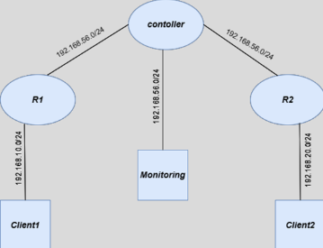
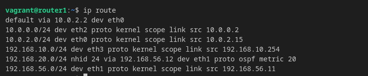
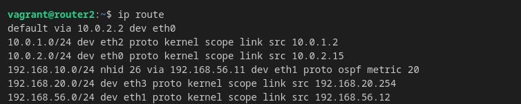
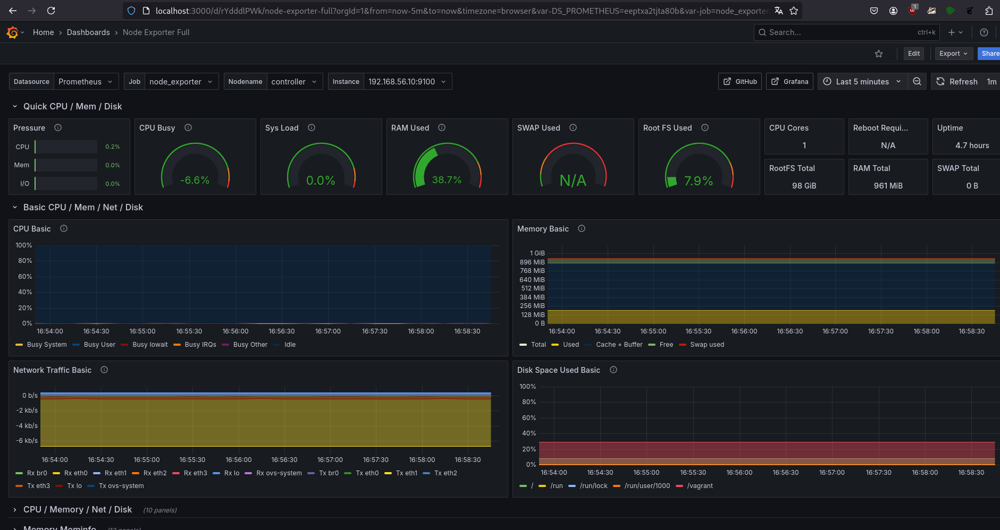

# Projet Cloud SDN Lab

## Objectif

Concevoir et déployer une infrastructure réseau automatisée incluant :

- Des VMs provisionnées automatiquement via Vagrant 
 - Un plan de données programmable avec Open vSwitch et OpenFlow 
 - Un plan de contrôle dynamique utilisant OSPF (via FRRouting) 
 - Un contrôleur SDN basé sur Ryu 
 - Des scripts de déploiement pour automatiser la configuration complète 

## Architecture mise en place
6 machines virtuelles créées : 

- Controller (Ryu + Open vSwitch) 
- Router1 (FRRouting avec OSPF) 
- Router2 (FRRouting avec OSPF) 
- Client1 et client2 (pour les tests de connectivité) 
- Monitoring (Prometheus + Grafana) 
- Configuration réseau statique via intnet VirtualBox et interfaces privées

### Shéma réseau



---

## Infrastructure

### Machines virtuelles (Vagrant)

| Nom        | Rôle                    | Réseaux / IPs                         |
|------------|-------------------------|----------------------------------------|
| `controller` | SDN Controller (Ryu + OVS) | `192.168.56.10` + interfaces OVS sans IP |
| `router1`   | Routeur OSPF + Client 1     | `192.168.56.11`, `10.0.0.2`, `192.168.10.254` |
| `router2`   | Routeur OSPF + Client 2     | `192.168.56.12`, `10.0.1.2`, `192.168.20.254` |
| `client1`   | Hôte client 1              | `192.168.10.2`                         |
| `client2`   | Hôte client 2              | `192.168.20.2`                         |
| `monitoring`| Grafana + Prometheus | `192.168.56.13`                      |

---

## Provisioning (automatisé)

| Composant              | Playbook / Script                           |
|------------------------|---------------------------------------------|
| VMs + réseaux          | `Vagrantfile`, `inventory.ini`              |
| Ryu + OVS              | `playbook_ryu.yml`, `switch.py`             |
| Routeurs OSPF (FRR)    | `playbook_frr.yml`, `playbook_interfaces.yml`, , `frr.conf.j2`, `interfaces_router1.j2`, `interfaces_router2.j2` |
| Exporters Prometheus   | `playbook_node-exporter.yml`, `playbook_ospf-exporter.yml`, `prometheus.j2` |
| Monitoring             | `playbook_monitoring.yml` |

---

### Étapes de test et résultats

#### Étape 1 : Provisionnement des VMs

Les machines virtuelles ont été déployées automatiquement avec Vagrant. La configuration réseau et les logiciels requis ont été installés avec succès.

#### Étape 2 : Mise en place du routage OSPF

Les routeurs ont échangé les routes dynamiquement via OSPF. La table de routage obtenue avec vtysh sur le routeur 1 et 2 confirme le bon fonctionnement.

- Vtysh sur Routeur1


- IP route sur le routeur1 



- Vtysh sur Routeur2


- IP route sur le routeur2



#### Étape 3 : Vérification de la connectivité réseau

Un test de ping entre les VMs a confirmé la connectivité.

- Test de ping depuis le routeur1 vers le client1 (loopback inclue)


- Test de ping depuis le routeur2 vers le client2 (loopback inclue)


#### Étape 4 : Connexion au contrôleur Ryu

Le contrôleur Ryu a détecté les switches OVS et a été configuré pour injecter des règles OpenFlow.

- Conguration OVS


- Flows OpenFlow visibles avec ovsofctl


#### Étape 5 : supervision des VMs avec Prometheus + Grafana

- Dashboard du Contrôleur (Grafana)



- Dashboard du Router1 (Grafana)


- Dashboard du Router2 (Grafana)


- Etat de targets (Prometheus)


## Tests & vérifications

### Connectivité réseau

```bash
# Depuis router1
ping 10.0.0.2       # loopback test
ping 192.168.10.2   # client1

# Depuis router2
ping 10.0.1.2       # loopback test
ping 192.168.20.2   # client2
```

### FRRouting (vtysh)

```bash
# Depuis router1 & router2
sudo vtysh -c "show ip ospf neighbor"
sudo vtysh -c "show ip route ospf"
sudo vtysh -c "show ip route"
sudo vtysh -c "show ip ospf database"
sudo vtysh -c "show running-config"
```

### OpenFlow (Ryu)

```bash
# Depuis controller
sudo ovs-ofctl -O OpenFlow13 dump-flows br0
sudo systemctl status ryu
sudo tail -f /var/log/syslog | grep ryu
```

### Monitoring

### [Accès Grafana](http://localhost:3000)

1. Informations d'identification :
    - User : admin
    - Password : admin

2. Cliquer sur Skip

3. Accéder au menu "Dashboard", puis sélectionner "Node Exporter Full"

### [Accès Prometheus](http://localhost:9090)

## Retour d’expérience

### Problèmes rencontrés

- La communication entre les clients ne fonctionne pas encore (192.168.10.2 vers 192.168.20.2) 
- Les règles OpenFlow sont statiques : pas de gestion dynamique des flux (pas de MAC learning) 
- Le routage OSPF est opérationnel entre les routeurs, mais la communication entre les clients requiert une configuration explicite des passerelles ou du routage sur les hôtes 
- Débogage complexe entre la couche OpenFlow, OVS et le plan de routage dynamique 

## Points d’amélioration 

- Ajouter un switch Ryu dynamique avec apprentissage de MAC (switch L2) 
- Ajouter des scripts de tests automatisés (Ansible ou Bash)

## Ajout complémentaire : Exporter OSPF 

Un script a été implémenté sur chaque routeur pour exporter les informations OSPF. Ce script est lancé automatiquement via un service personnalisé systemd, permettant une supervision continue et une intégration aisée dans les outils de monitoring comme Prometheus. 

## Structure du dépôt

```
.
├── ansible
│   ├── files
│   │   ├── 1860_rev41.json
│   │   ├── frr_ospf_exporter.py
│   │   ├── requirements.txt
│   │   ├── ryu.service
│   │   └── switch.py
│   ├── inventory.ini
│   ├── playbook_client.yml
│   ├── playbook_frr.yml
│   ├── playbook_interfaces.yml
│   ├── playbook_monitoring.yml
│   ├── playbook_node-exporter.yml
│   ├── playbook_ospf-exporter.yml
│   ├── playbook_ryu.yml
│   └── templates
│       ├── frr.conf.j2
│       ├── interfaces_router1.j2
│       ├── interfaces_router2.j2
│       └── prometheus.j2
├── docs
│   └── Cahier_Des_Charges_Projet_Reseau_Cloud.pdf
├── README.md
└── Vagrantfile
```

---

## Lancement

```bash
vagrant up
```